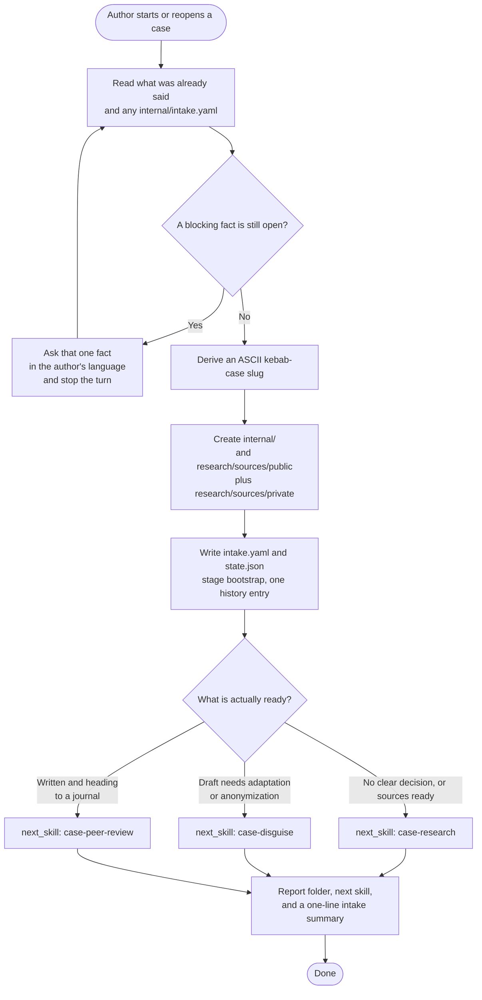

# case-bootstrap

First skill in the case-writing pipeline. Collects one missing intake fact at a time, then scaffolds `case-<slug>/`, writes `internal/intake.yaml` and `internal/state.json`, and routes to the next skill. Idempotent. It creates `internal/` and `research/sources/` only. Later skills write `case.md` and `teaching-note.md` when those documents exist.

## Install

Install this skill together with the other six case skills:

```bash
npx skills add gg-skills/case-writing-skills -y
```

Install only this skill:

```bash
npx skills add gg-skills/case-bootstrap -y
```

Drop this skill into a workspace as a Git submodule for pinned versions, or as a plain clone for latest `main`:

```bash
# Project-local, version-pinned:
git submodule add git@github.com:gg-skills/case-bootstrap.git .claude/skills/case-bootstrap

# OR project-local, latest main:
mkdir -p .claude/skills
git -C .claude/skills clone git@github.com:gg-skills/case-bootstrap.git

# OR user-level, available in every project on this machine:
mkdir -p ~/.claude/skills
git -C ~/.claude/skills clone git@github.com:gg-skills/case-bootstrap.git
```

Restart your agent or reload skills after installation. See the parent [`skills` catalog repo](https://github.com/gg-skills/skills) for the full catalog.

## When to use

- Starting a new business case from scratch.
- The author says they want to write a case about a subject, or asks for a new case.
- Re-opening a case whose `internal/state.json` is missing or stale.

**Skip when:**

- The case folder already has a populated `internal/state.json`. Continue with `case-research` or the downstream skill the state names.
- The author wants to revise intake metadata without re-scaffolding. Edit `internal/intake.yaml` directly.
- The task is research, drafting, classroom testing, or review of a case that is already bootstrapped.

## How it operates

### Inputs

**Facts already given** — anything the author has said, plus an existing `internal/intake.yaml` if this is a rerun. Missing facts are collected one at a time from [`references/intake-questions.md`](references/intake-questions.md).

**Existing case folder** — on a rerun, the current `case-<slug>/` is the idempotency check. Artifact files already there are left alone.

### Outputs

- `case-<slug>/internal/state.json` with `schema_version: 2`, `stage: "bootstrap"`, and one history entry. A rerun preserves a later successful stage and appends history.
- `case-<slug>/internal/intake.yaml` with the intake config. Uncollected audience, location, and journal stay `null`. When the author has already named the doubt or a set of products, people, or markets to compare, store `teaching_tension` and `contrast_set` in that file and in `config`, and pass any stored value to research. Otherwise both stay `null`. They are not blocking questions.
- `case-<slug>/research/sources/public/` and `research/sources/private/`, ready for `case-research`.
- A report of the folder path, the chosen `next_skill`, and a one-line intake summary. No folder is reported until it exists.

### External commands

Bootstrap does not render documents. It does not create placeholder `case.md` or `teaching-note.md` files. The renderer shipped in this package is for later skills:

```bash
node .agents/skills/case-bootstrap/scripts/render-reader-formats.ts --help
```

### Side effects

- Creates the case folder only after blocking intake facts are answered or explicitly deferred.
- Updates `internal/state.json` and `internal/intake.yaml` when intake answers change.
- Does not edit `AGENTS.md`, `INDICE.md`, `governanca/decisoes-sobre-skills.md`, or other global files.
- Does not commit, push, merge, or publish.

### Mode toggles

| Mode | Behavior |
|------|----------|
| New case | Ask the first open blocking fact, then scaffold and route |
| Rerun | Do not duplicate files. Append history. Leave artifact files alone |
| Publication already written | Route to `case-peer-review`, asking the journal first when it is unset |
| Existing draft needs a variant | Route to `case-disguise`, including before the first pilot |

## Operational flow



## Layout

```
.
├── SKILL.md
├── README.md
├── package.json
├── agents/
│   └── openai.yaml
├── assets/
│   └── icon-small.svg
├── references/
│   ├── case-folder-convention.md    ← folder layout and state.json spec
│   ├── intake-questions.md          ← one-fact question order and validation
│   ├── reader-formats.md            ← Markdown, HTML, and PDF rules for later skills
│   └── state-schema.md              ← internal/state.json schema
└── scripts/
    └── render-reader-formats.ts     ← HTML and PDF renderer used by later skills
```

## Quick start

Read [`SKILL.md`](./SKILL.md) first. It has the intake order, the routing table, and the idempotency rules.

```bash
# Confirm which intake fact is still blocking before scaffolding.
# The question list and validation rules:
# references/intake-questions.md

# State written after the blocking facts are settled:
# case-<slug>/internal/state.json
# case-<slug>/internal/intake.yaml
```

Key rule: ask one open blocking fact and stop the turn. Do not send the whole intake as a numbered list.

## Resources

- [`SKILL.md`](./SKILL.md) — intake, scaffold, routing, and limits
- [`references/intake-questions.md`](references/intake-questions.md) — canonical question wording
- [`references/state-schema.md`](references/state-schema.md) — `internal/state.json`
- [`references/case-folder-convention.md`](references/case-folder-convention.md) — folder layout shared by the pipeline
- [`references/reader-formats.md`](references/reader-formats.md) — when a later skill renders HTML and PDF
- [`agents/openai.yaml`](agents/openai.yaml) — agent interface definition

## Caveats

- **One fact per turn.** Listing every missing field in one message stalls the author and skips the harness question tool.
- **Scaffold only after the blocking facts are settled.** Do not create a folder, then ask for the subject.
- **Slugs are ASCII kebab-case.** Accents and uppercase letters break downstream paths.
- **A rerun must not duplicate files.** Preserve a later successful `stage` and leave artifact files alone.
- **`next_skill` is never null after a completed bootstrap.** A null route stalls the pipeline.
- **No placeholder documents.** `case.md` and `teaching-note.md` appear when a later skill writes them.
- **No publish step.** Commits and pushes stay on the project's ordinary git workflow.
