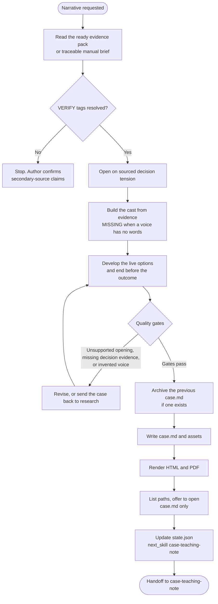

# case-business-case

Drafts the teaching-case narrative from a ready evidence pack or the author's traceable manual evidence brief. The body opens on sourced decision tension, develops the relevant context and live options, and ends before the outcome. An outside objection, five-beat business walk, or calculable exhibit applies when the decision and evidence call for it. Theory stays in `case-teaching-note`. Dialogue is optional. The reader sees a sourced translation in the language of the case; the verbatim original may follow as a secondary line. A missing voice is `[MISSING]`, never reconstructed speech. Markdown stays canonical; HTML and PDF are reading copies.

## Install

The fastest cross-agent install path is the `skills` CLI:

```bash
npx skills add gg-skills/case-business-case
```

Drop this skill into a workspace as a Git submodule for pinned versions, or as a plain clone for latest `main`:

```bash
# Project-local, version-pinned:
git submodule add git@github.com:gg-skills/case-business-case.git .claude/skills/case-business-case

# OR project-local, latest main:
mkdir -p .claude/skills
git -C .claude/skills clone git@github.com:gg-skills/case-business-case.git

# OR user-level, available in every project on this machine:
mkdir -p ~/.claude/skills
git -C ~/.claude/skills clone git@github.com:gg-skills/case-business-case.git
```

Restart your agent or reload skills after installation. See the parent [`skills` catalog repo](https://github.com/gg-skills/skills) for the full catalog.

## When to use

- The evidence pack is ready, or the author supplies a traceable manual evidence brief; material `[VERIFY]` tags are resolved before use.
- The author wants the case narrative written or rewritten.
- A decision point exists and the evidence can describe the actors. A decision-relevant voice with no primary words stays `[MISSING]`.

**Skip when:**

- Neither a ready evidence pack nor a traceable manual evidence brief exists. Run `case-research` first.
- The author wants to refine an existing draft rather than rewrite it. Edit the draft directly.
- The piece is purely theoretical and has no actors or situation to narrate.

## How it operates

### Inputs

**Evidence** — the six files in `case-<slug>/research/` or an author-supplied manual brief with source paths and gaps.

**Verification** — the author's confirmation that `[VERIFY]` tags are resolved.

**Structural preference** — used when the author has one. Otherwise open on sourced tension, develop the live options, and end without telling the outcome. Use business walks and calculations when relevant.

### Outputs

- `case-<slug>/case.md` — the canonical narrative. Figures used in the case live in `assets/`.
- `case-<slug>/case.html` and `case-<slug>/case.pdf` — reading copies.
- Updated `internal/state.json` with `stage: "case-business-case"`, `next_skill: "case-teaching-note"`, and one history entry.

If `case.md` already exists, the skill moves it with its `.html`, `.pdf`, and `assets/` into `archive/<yyyy-mm-dd-hhmm>/` before writing the replacement.

### External commands

```bash
node .agents/skills/case-business-case/scripts/render-reader-formats.ts \
  --input case-<slug>/case.md

node .agents/skills/case-business-case/scripts/render-reader-formats.ts \
  --input case-<slug>/case.md --open pdf
```

List every generated path, then offer to open only the case (`case.md`), PDF first. Pass `--open` only after the author chooses a format. PDF printing uses headless Chrome or Chromium (`CASE_WRITING_CHROME` or `--chrome PATH`).

### Side effects

- Writes the case at the case root, or at a variant path when the caller supplies one. Masters stay put unless the caller is editing that variant.
- Archives the previous `case.md` and its reading copies before a replacement.
- Does not write the teaching note, the slide deck, or a participant guide.
- Does not invent facts or dialogue, and does not tell the outcome. A missing voice is `[MISSING]` and a question to the author, not a reconstructed quote from a published teaching case, a later interview, or a character sketch.
- Does not run a full anonymization pass. That is a separate copy from `case-disguise`.
- Does not commit or publish.

### Mode toggles

| Mode | Behavior |
|------|----------|
| Opening | Sourced decision tension; use an outside objection and replies when they exist and fit |
| Context after that exchange | Sector context follows the opening, or carries it when the author asks for context first |
| Variant path | Read and write the caller's case path. Preserve the master |
| Blocked | Keep the last successful stage and record what is still missing |

## Operational flow



## Layout

```
.
├── SKILL.md
├── README.md
├── package.json
├── agents/
│   └── openai.yaml
├── assets/
│   └── icon-small.svg
├── references/
│   ├── hybrid-form.md                ← opening, context, and decision ending
│   ├── character-construction.md     ← what keeps a character anchored
│   ├── case-folder-convention.md     ← folder and state schema
│   └── reader-formats.md             ← Markdown canonical, HTML and PDF copies
└── scripts/
    └── render-reader-formats.ts
```

## Quick start

Read [`SKILL.md`](./SKILL.md) and [`references/hybrid-form.md`](references/hybrid-form.md) before drafting.

```bash
node .agents/skills/case-business-case/scripts/render-reader-formats.ts \
  --input case-<slug>/case.md
```

The opening must establish a sourced decision tension. A scene is optional and must be evidenced. A quantitative choice needs a calculable exhibit; a qualitative choice needs the evidence that lets students compare the options.

## Resources

- [`SKILL.md`](./SKILL.md) — structure, cast, quality gates, and state update
- [`references/hybrid-form.md`](references/hybrid-form.md) — adaptable opening and sourced narrative
- [`references/character-construction.md`](references/character-construction.md) — actors, motives, and voice
- [`references/case-folder-convention.md`](references/case-folder-convention.md) — folder convention
- [`references/reader-formats.md`](references/reader-formats.md) — render rules, paths to list, and the one file to offer to open
- [`agents/openai.yaml`](agents/openai.yaml) — agent interface definition

## Caveats

- **No theory in the case body.** Frameworks and citations belong in the teaching note.
- **Do not invent dialogue.** A missing voice is `[MISSING]` and a question to the author, not a reconstructed quote from a published teaching case, a later interview, or a character sketch. Indirect speech is allowed only when the source itself states the position.
- **Show the quotation already translated.** The highlighted sentence is the language of the case. `*Original:*` is the optional verbatim line beneath it. Do not lead with the source language and gloss it afterwards.
- **Do not tell the outcome.** The ending keeps the live options analyzable with sourced arguments for each.
- **Open on sourced tension.** Use an objection and replies only when documented; another evidenced event or deadline can open the case.
- **A quantitative choice needs calculable evidence.** A segment income statement alone does not show each option's consequence. Return to research when material inputs are missing.
- **Every number traces to the evidence pack**, with a source id and a page.
- **Anonymize by copying.** `case-disguise` prepares the separate copy. This skill keeps the research sources.
- **Markdown stays canonical.** Do not edit the HTML or PDF as the source.
