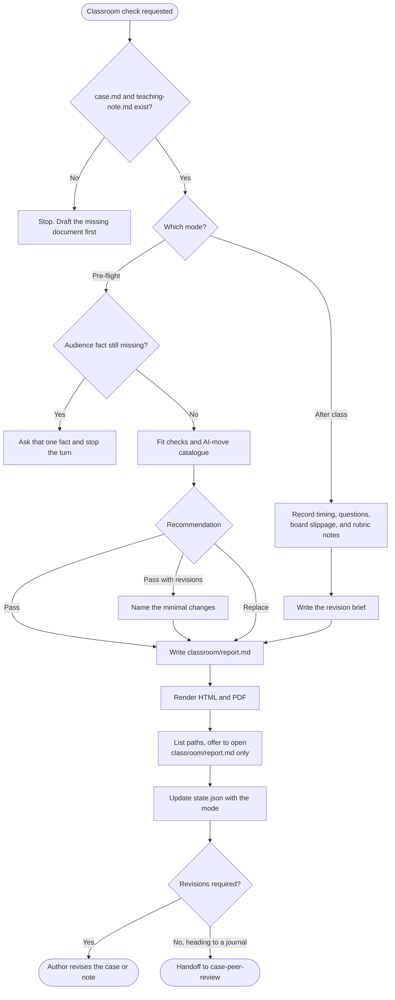

# case-classroom-test

Pre-flight and post-class checks for a business case and its teaching note. Pre-flight looks for audience-fit problems, complexity that is wrong for the level, and AI-assisted shortcuts before students see the case. After a real session it records timing, the question log, board-plan slippage, and a prioritized revision brief. The report Markdown stays canonical. The skill also writes HTML and PDF and asks which format to open.

## Install

The fastest cross-agent install path is the `skills` CLI:

```bash
npx skills add gg-skills/case-classroom-test
```

Drop this skill into a workspace as a Git submodule for pinned versions, or as a plain clone for latest `main`:

```bash
# Project-local, version-pinned:
git submodule add git@github.com:gg-skills/case-classroom-test.git .claude/skills/case-classroom-test

# OR project-local, latest main:
mkdir -p .claude/skills
git -C .claude/skills clone git@github.com:gg-skills/case-classroom-test.git

# OR user-level, available in every project on this machine:
mkdir -p ~/.claude/skills
git -C ~/.claude/skills clone git@github.com:gg-skills/case-classroom-test.git
```

Restart your agent or reload skills after installation. See the parent [`skills` catalog repo](https://github.com/gg-skills/skills) for the full catalog.

## When to use

- A case and teaching note are about to be taught, and the author wants a pre-flight check.
- The author wants to know whether the case will land with a stated audience before booking the session.
- A class has already happened and the instructor can report what occurred.
- A published case needs a fit check for a different audience.

**Skip when:**

- The case has not been written yet.
- The deliverable is a journal submission review. Use `case-peer-review`.
- The case will not be taught.

## How it operates

### Inputs

**Documents** — `case.md` and `teaching-note.md`, or the variant paths the caller supplies.

**Pre-flight profile** — stored `audience_level`, `discipline` (a list of one or more fields), and `audience_location`. The first report is written without questions: a missing level, location, prior case exposure, or AI tool access is marked as not informed, and the checks that depend on it say so. Adding those facts is offered after the report.

**Real-classroom report** — what the instructor observed: planned versus actual time, questions, board drift, and assessment notes. The skill does not run the session.

### Outputs

- `case-<slug>/classroom/report.md` — the canonical report, marked as pre-flight or real-classroom.
- `classroom/report.html` and `classroom/report.pdf`.
- Updated `internal/state.json`. The history entry records the mode.
- Pre-flight ends in pass, pass-with-revisions, or replace. Pass-with-revisions includes the smallest set of changes.
- Real-classroom ends in a revision brief the author can apply.

`next_skill` follows the work that remains. A clean pre-flight heading toward submission routes toward `case-peer-review`. A revision brief routes back to the author and the skill that owns the file being changed.

### External commands

```bash
node .agents/skills/case-classroom-test/scripts/render-reader-formats.ts \
  --input case-<slug>/classroom/report.md

node .agents/skills/case-classroom-test/scripts/render-reader-formats.ts \
  --input case-<slug>/classroom/report.md --open pdf
```

List every generated path, then offer to open only the classroom report (`classroom/report.md`), PDF first. Pass `--open` only after the author chooses a format. PDF printing uses headless Chrome or Chromium (`CASE_WRITING_CHROME` or `--chrome PATH`).

### Side effects

- Writes the classroom report and its reading copies.
- May store a newly answered level, discipline list, or location in `internal/intake.yaml` and `config`. Prior exposure and AI access stay in the report.
- Does not rewrite the case or the teaching note.
- Does not invent audience data. Geographic or demographic claims need the author or a cited public source.
- Does not commit or publish.

### Mode toggles

| Mode | Behavior |
|------|----------|
| Pre-flight | Fit checks, AI-move catalogue, and a pass / revise / replace recommendation |
| Real-classroom | Timing log, question log, board slippage, rubric notes, revision brief |
| AI-move catalogue | Used inside pre-flight and refreshed after every pilot |
| Variant | Read and write the caller's report path. Preserve the masters |

## Operational flow



## Layout

```
.
├── SKILL.md
├── README.md
├── package.json
├── agents/
│   └── openai.yaml
├── assets/
│   └── icon-small.svg
├── references/
│   ├── pre-flight-checks.md          ← fit-check catalogue
│   ├── ai-assisted-moves.md          ← likely student shortcuts by case type
│   ├── timing-log-template.md        ← real-classroom log
│   ├── case-folder-convention.md
│   └── reader-formats.md
└── scripts/
    └── render-reader-formats.ts
```

## Quick start

Read [`SKILL.md`](./SKILL.md). Use [`references/pre-flight-checks.md`](references/pre-flight-checks.md) before class and [`references/timing-log-template.md`](references/timing-log-template.md) after it.

```bash
node .agents/skills/case-classroom-test/scripts/render-reader-formats.ts \
  --input case-<slug>/classroom/report.md
```

A pre-flight without an audience profile produces generic advice. Ask the first missing audience fact instead of guessing.

## Resources

- [`SKILL.md`](./SKILL.md) — both modes, the AI-move catalogue, and state update
- [`references/pre-flight-checks.md`](references/pre-flight-checks.md) — checks and examples
- [`references/ai-assisted-moves.md`](references/ai-assisted-moves.md) — shortcuts and counter-questions
- [`references/timing-log-template.md`](references/timing-log-template.md) — planned versus actual blocks
- [`references/case-folder-convention.md`](references/case-folder-convention.md) — folder and state schema
- [`references/reader-formats.md`](references/reader-formats.md) — render rules, paths to list, and the one file to offer to open
- [`agents/openai.yaml`](agents/openai.yaml) — agent interface definition

## Caveats

- **Audience data comes from the author or a cited source.** Do not invent a city, a cohort, or a tool policy.
- **Do not block an AI shortcut with a trap.** Students notice, and the case loses credibility. Use a counter-question.
- **Record the question log with the timing log.** A slipped block often hides a question that failed.
- **Refresh the AI-move catalogue after every pilot.** It is not a one-shot list.
- **This is not a journal review.** Submission critique belongs to `case-peer-review`.
- **The skill does not teach the class.** It records what the instructor reports.
- **A finished report is not approval.** Pass-with-revisions still sends work back to the author.
- **Markdown stays canonical.** Regenerate HTML and PDF from `classroom/report.md`.
