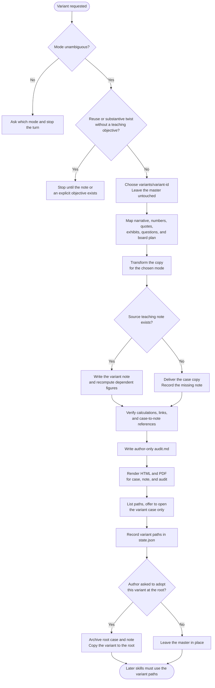

# case-disguise

Creates a separate variant of an existing case and, when one exists, its teaching note. Use it for a substantive twist, a surface disguise, both layers together, or anonymization before a pilot or a publication. Master files and research sources stay unchanged. Dependent numbers, questions, and board-plan references are updated in the copy. An author-only audit trail records every change. Each Markdown file written in the run stays canonical. The skill also writes HTML and PDF and asks which format to open. The audit copies stay author-only.

## Install

The fastest cross-agent install path is the `skills` CLI:

```bash
npx skills add gg-skills/case-disguise
```

Drop this skill into a workspace as a Git submodule for pinned versions, or as a plain clone for latest `main`:

```bash
# Project-local, version-pinned:
git submodule add git@github.com:gg-skills/case-disguise.git .claude/skills/case-disguise

# OR project-local, latest main:
mkdir -p .claude/skills
git -C .claude/skills clone git@github.com:gg-skills/case-disguise.git

# OR user-level, available in every project on this machine:
mkdir -p ~/.claude/skills
git -C ~/.claude/skills clone git@github.com:gg-skills/case-disguise.git
```

Restart your agent or reload skills after installation. See the parent [`skills` catalog repo](https://github.com/gg-skills/skills) for the full catalog.

## When to use

- The author wants a substantive twist: another geography, date, or protagonist, with the teaching objective and decision type preserved.
- The author wants a surface disguise: rotated names, title, prices, or costs so another cohort cannot reuse answers.
- The author wants both layers, recorded separately.
- The author wants an anonymized copy for a classroom or a venue, including before the first pilot.

**Skip when:**

- The task is original authorship. Draft with `case-business-case` and `case-teaching-note`.
- The request is an ordinary edit and no variant was asked for.
- The author wants a journal-style critique of the current manuscript. Use `case-peer-review`.

## How it operates

### Inputs

**Source** — an existing case or draft, its teaching note when one exists, linked exhibits, and the relevant evidence.

**Mode and audience** — substantive twist, surface disguise, combined, or anonymization, plus who will see the copy. If the request fits more than one mode, ask which one and stop the turn.

**Teaching objective** — required for reuse and substantive adaptation, either from the teaching note or from an explicit statement. Anonymization can proceed from a draft alone and records a missing note as a limitation.

### Outputs

Under `variants/<variant-id>/`, unless the author names another destination:

- `case.md` — the transformed case.
- `teaching-note.md` — the matching note when a source note exists.
- Assets copied or transformed, with working relative links.
- `audit.md` — the author-only change table, rules, identity crosswalk, and readiness notes.

Each of those Markdown files gets a sibling `.html` and `.pdf`. The audit trail's HTML and PDF stay beside `audit.md` and out of student or submission copies. `internal/state.json` records the variant paths. A later skill must be pointed at those paths, not at the master.

The current root `case.md` and `teaching-note.md` move to `archive/<yyyy-mm-dd-hhmm>/`, and the variant is copied to the root, only when the author asks to adopt that variant.

### External commands

```bash
node .agents/skills/case-disguise/scripts/render-reader-formats.ts \
  --input case-<slug>/variants/<variant-id>/case.md

node .agents/skills/case-disguise/scripts/render-reader-formats.ts \
  --input case-<slug>/variants/<variant-id>/case.md --open pdf
```

Render the case, the note, and `audit.md`. List every generated path, then offer to open only the variant's `case.md`, PDF first, or its `teaching-note.md` when only the note changed. Never offer `audit.md`. Pass `--open` only after the author chooses a format. PDF printing uses headless Chrome or Chromium (`CASE_WRITING_CHROME` or `--chrome PATH`).

### Side effects

- Writes a new variant folder. An existing variant is updated only when the author is continuing that variant.
- Leaves master artifacts and `research/sources/` unchanged.
- Does not grant permission or change `permission_status`.
- Does not submit or distribute the variant, and does not claim the subject is guaranteed to be anonymous.
- Does not commit or publish.

### Mode toggles

| Mode | Behavior |
|------|----------|
| Substantive twist | Research the requested locale or period, cite inputs, recompute dependent data |
| Surface disguise | Apply a reproducible rotation and record original, rule, and result |
| Combined | Record the substantive layer, then the surface layer |
| Anonymization | Generalize identifying details. Keep the identity map in the author-only audit |
| Adopt | Archive the root documents and copy this variant to the root, only on request |

## Operational flow



## Layout

```
.
├── SKILL.md
├── README.md
├── package.json
├── agents/
│   └── openai.yaml
├── assets/
│   └── icon-small.svg
├── references/
│   ├── rotation-rules.md                 ← surface changes and the change table
│   ├── substantive-twist-patterns.md     ← locale, date, and protagonist twists
│   ├── case-folder-convention.md         ← variant storage and state
│   └── reader-formats.md                 ← including author-only audit copies
└── scripts/
    └── render-reader-formats.ts
```

## Quick start

Read [`SKILL.md`](./SKILL.md). Load [`references/substantive-twist-patterns.md`](references/substantive-twist-patterns.md) or [`references/rotation-rules.md`](references/rotation-rules.md) for the requested mode.

```bash
node .agents/skills/case-disguise/scripts/render-reader-formats.ts \
  --input case-<slug>/variants/<variant-id>/case.md
```

Do not open or distribute `audit.md`, its HTML, or its PDF to students or to a venue.

## Resources

- [`SKILL.md`](./SKILL.md) — modes, dependency map, verification, and routing
- [`references/rotation-rules.md`](references/rotation-rules.md) — reproducible surface changes
- [`references/substantive-twist-patterns.md`](references/substantive-twist-patterns.md) — twists that keep the decision type
- [`references/case-folder-convention.md`](references/case-folder-convention.md) — where variants and the audit live
- [`references/reader-formats.md`](references/reader-formats.md) — render rules, including the audit trail
- [`agents/openai.yaml`](agents/openai.yaml) — agent interface definition

## Caveats

- **The master stays the master** until the author explicitly adopts a variant.
- **A pseudonym is not anonymization.** Names, organizations, dates, filenames, links, exhibit labels, and distinctive quotes can still identify the subject.
- **The identity crosswalk is author-only.** It stays in `audit.md` and out of every student or submission copy.
- **Label transformed facts as transformed.** Do not present a recomputed price or a moved city as unchanged historical evidence.
- **Keep reader quotations in the variant's language.** The highlighted sentence is that wording. Change it together with the optional `*Original:*` line. Leave the source sentence off a student copy when it would identify the subject, and keep it in `audit.md`.
- **Recompute the teaching note.** A case copy whose note still has the old numbers is not ready to teach.
- **A missing note is a limitation, not a silent pass.** Route note work to `case-teaching-note` with the variant path.
- **Anonymization does not grant permission** and does not change `permission_status`.
- **Do not claim the subject cannot be recognized.** Record unresolved identifying details for the author.
- **Markdown stays canonical.** Regenerate HTML and PDF from the variant documents. The audit copies remain author-only.
