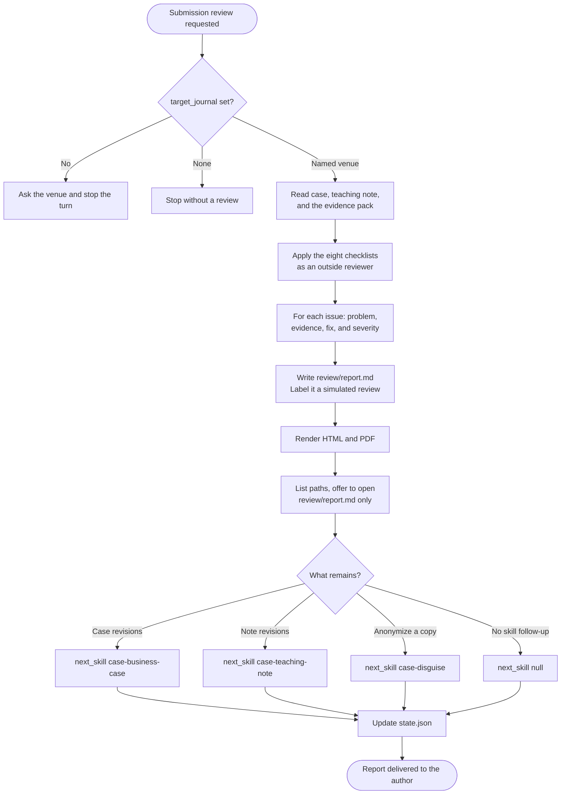

# case-peer-review

Simulates a blind peer review of a business case and its teaching note before journal submission. It adopts a reviewer stance for Ivey, Case Centre, HBP, RAE, or another named venue, applies eight checklists, and tags each issue as `impeditiva`, `importante`, or `menor`. The result is a structured critique for the author. It is not a real editorial review. The report Markdown stays canonical. The skill also writes HTML and PDF and asks which format to open.

## Install

The fastest cross-agent install path is the `skills` CLI:

```bash
npx skills add gg-skills/case-peer-review
```

Drop this skill into a workspace as a Git submodule for pinned versions, or as a plain clone for latest `main`:

```bash
# Project-local, version-pinned:
git submodule add git@github.com:gg-skills/case-peer-review.git .claude/skills/case-peer-review

# OR project-local, latest main:
mkdir -p .claude/skills
git -C .claude/skills clone git@github.com:gg-skills/case-peer-review.git

# OR user-level, available in every project on this machine:
mkdir -p ~/.claude/skills
git -C ~/.claude/skills clone git@github.com:gg-skills/case-peer-review.git
```

Restart your agent or reload skills after installation. See the parent [`skills` catalog repo](https://github.com/gg-skills/skills) for the full catalog.

## When to use

- The author intends to submit the case and teaching note to a journal.
- A draft has been revised after a classroom pilot and is ready for an outside-style reading.
- The author wants a simulated review before paying a submission fee.

**Skip when:**

- The case is for internal use and will not be submitted.
- The deliverable is classroom feedback. Use `case-classroom-test`.
- The author wants a variant, a disguise, or an anonymized copy. Use `case-disguise`.

## How it operates

### Inputs

**Manuscript** — `case.md`, `teaching-note.md`, and the evidence pack. A variant review uses the paths the caller supplies.

**Venue** — `target_journal` in `internal/intake.yaml`. If it is unset, the skill asks which venue and stops before reviewing. The choices are Ivey, Case Centre, HBP, RAE, another named venue, or none. "None" stops the run with no submission review.

**Revision history** — prior critiques the author has already addressed, so the report does not repeat them.

### Outputs

- `case-<slug>/review/report.md` — problem, evidence, suggested correction, and severity for each issue.
- `review/report.html` and `review/report.pdf`.
- Updated `internal/state.json` with `stage: "case-peer-review"` and one history entry.

`next_skill` follows the remaining work: `case-business-case` or `case-teaching-note` for revisions, `case-disguise` for anonymization, `case-package` only when that skill exists and the author asks for it, or `null` when the requested review has no skill follow-up.

### External commands

```bash
node .agents/skills/case-peer-review/scripts/render-reader-formats.ts \
  --input case-<slug>/review/report.md

node .agents/skills/case-peer-review/scripts/render-reader-formats.ts \
  --input case-<slug>/review/report.md --open pdf
```

List every generated path, then offer to open only the review report (`review/report.md`), PDF first. Pass `--open` only after the author chooses a format. PDF printing uses headless Chrome or Chromium (`CASE_WRITING_CHROME` or `--chrome PATH`).

### Side effects

- Writes the review report and its reading copies.
- Stores a newly chosen journal in `internal/intake.yaml` and `config`.
- Does not edit the case or the teaching note, and does not submit anything.
- Does not anonymize files. Review the anonymized variant when that copy is the submission target.
- Does not commit or publish.

### Mode toggles

| Mode | Behavior |
|------|----------|
| Venue unset | Ask once, store the answer, and do not start the checklists |
| Venue is none | Stop. No submission review |
| Named venue | Adopt that reviewer stance and apply all eight checklists |
| Variant | Review the supplied copy. Preserve the masters |

The eight checklists are decision clarity, case-versus-note separation, source verifiability, measurable objectives, a replicable lesson plan, audience fit, originality, and editorial format.

Severity: `impeditiva` blocks publication, `importante` should be fixed before the next round, `menor` is optional.

## Operational flow



## Layout

```
.
├── SKILL.md
├── README.md
├── package.json
├── agents/
│   └── openai.yaml
├── assets/
│   └── icon-small.svg
├── references/
│   ├── checklists.md                 ← eight checklists and severity rules
│   ├── reviewer-personas.md          ← Ivey, Case Centre, HBP, RAE, and other
│   ├── case-folder-convention.md
│   └── reader-formats.md
└── scripts/
    └── render-reader-formats.ts
```

## Quick start

Read [`SKILL.md`](./SKILL.md) and [`references/checklists.md`](references/checklists.md). Confirm `target_journal` before applying the lists.

```bash
node .agents/skills/case-peer-review/scripts/render-reader-formats.ts \
  --input case-<slug>/review/report.md
```

Every critique names a section and a fix. A comment that only says the case could be clearer is not a finding.

## Resources

- [`SKILL.md`](./SKILL.md) — persona, checklists, severity, and routing
- [`references/checklists.md`](references/checklists.md) — the eight lists with examples
- [`references/reviewer-personas.md`](references/reviewer-personas.md) — how each venue's stance differs
- [`references/case-folder-convention.md`](references/case-folder-convention.md) — folder and state schema
- [`references/reader-formats.md`](references/reader-formats.md) — render rules, paths to list, and the one file to offer to open
- [`agents/openai.yaml`](agents/openai.yaml) — agent interface definition

## Caveats

- **This is a simulated review.** The author must not present the report as a decision from a real editorial board.
- **Do not start without a venue.** Format conformance depends on the target journal.
- **Severity has to vary.** Marking every note `impeditiva` hides the blockers. Passing every list "in the spirit" of the draft hides them too.
- **Case-versus-note separation is the usual blocker.** Theory in the case body fails that checklist.
- **No vague suggestions.** Name the page or section and the correction.
- **The skill does not edit the manuscript and does not submit it.**
- **Anonymization is a different skill.** Route that copy to `case-disguise`, then review the variant if that is what will be submitted.
- **A completed review is not approval.** `impeditiva` findings send the draft back.
- **Markdown stays canonical.** Regenerate HTML and PDF from `review/report.md`.
