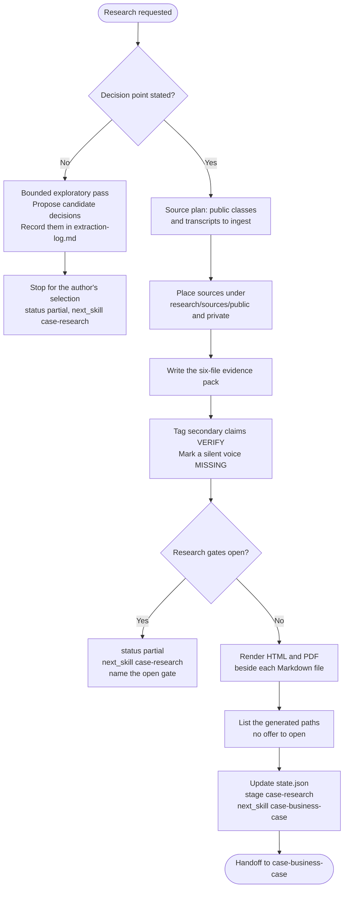

# case-research

Research skill for the case-writing pipeline. Combines public sources and private interview transcripts into a six-file evidence pack that `case-business-case` can draft from. Starts from the author's decision point, or from a bounded exploratory pass when that decision is still unclear. Secondary-source claims are tagged `[VERIFY]`. Each evidence file stays canonical Markdown. The skill also writes HTML and PDF and asks which format to open.

## Install

Install this skill together with the other six case skills:

```bash
npx skills add gg-skills/case-writing-skills -y
```

Install only this skill:

```bash
npx skills add gg-skills/case-research -y
```

Drop this skill into a workspace as a Git submodule for pinned versions, or as a plain clone for latest `main`:

```bash
# Project-local, version-pinned:
git submodule add git@github.com:gg-skills/case-research.git .claude/skills/case-research

# OR project-local, latest main:
mkdir -p .claude/skills
git -C .claude/skills clone git@github.com:gg-skills/case-research.git

# OR user-level, available in every project on this machine:
mkdir -p ~/.claude/skills
git -C ~/.claude/skills clone git@github.com:gg-skills/case-research.git
```

Restart your agent or reload skills after installation. See the parent [`skills` catalog repo](https://github.com/gg-skills/skills) for the full catalog.

## When to use

- The case needs evidence for a decision point, or the author needs a short exploratory pass to identify one.
- The author has interviews, transcripts, or public sources to ingest.
- An existing evidence pack needs to be refreshed.

**Skip when:**

- The case is purely illustrative and has no real primary data.
- The author only wants help framing documents they already trust. Use minimal existing-source mode to create `research/manual-evidence-brief.md` before drafting with `case-business-case`.
- The task is a journal-style review. Use `case-peer-review`.

## How it operates

### Inputs

**Decision or topic** — a decision statement, or a topic and scope for exploration. A missing discipline, audience, or journal does not block the exploratory pass.

**Sources** — public files under `case-<slug>/research/sources/public/<source-id>/` and transcripts under `research/sources/private/<interview-id>/`.

**Case state** — `internal/state.json` and `internal/intake.yaml`, read at the start of the run. Pass through `teaching_tension` and `contrast_set` when either is set. A null value stays null.

### Outputs

Six canonical Markdown files in `case-<slug>/research/`:

| File | Contents |
|------|----------|
| `timeline.md` | Chronological reconstruction, with a Mermaid timeline and a table |
| `cast.md` | Roles, motivations, and relationships, with a Mermaid graph |
| `financials.md` | Normalized figures, each sourced |
| `quotes-by-theme.md` | Verbatim quotes with theme, speaker, source, and page |
| `exhibit-candidates.md` | Proposed figures and tables with source data |
| `extraction-log.md` | What was extracted, gaps, OCR issues, and candidate decisions |

Each of those files also gets a sibling `.html` and `.pdf`. `internal/state.json` gains one history entry. A finished pack sets `stage: "case-research"` and `next_skill: "case-business-case"` only after the applicable gates in [`references/research-gates.md`](references/research-gates.md) pass. An exploratory pass, or a decision with a needed gate open, stays partial and routes to `case-research`.

### External commands

Render after the Markdown exists, once per file. List the generated paths. Do not offer to open evidence files: the file to offer is the case that `case-business-case` writes. Open one only when the author asks for that file.

```bash
node .agents/skills/case-research/scripts/render-reader-formats.ts \
  --input case-<slug>/research/timeline.md
```

PDF printing uses headless Chrome or Chromium. Set `CASE_WRITING_CHROME` or pass `--chrome PATH` when the browser is not on the default path.

### Side effects

- Writes authored evidence files under `research/`. Raw sources stay in `research/sources/` and are not rendered.
- Tags secondary-source numbers and quotes with `[VERIFY]`. A same-day newspaper is primary for what it printed. A quote taken from a published teaching case is not a primary source.
- A missing voice is `[MISSING]` and a question to the author, not a reconstructed quote from a published teaching case, a later interview, or a character sketch.
- Updates `internal/state.json`. Does not edit other skills' outputs or shared global files.
- Does not edit HTML or PDF as sources. Regenerate them from the Markdown.
- Does not commit or publish.

### Mode toggles

| Mode | Behavior |
|------|----------|
| Decision already stated | Build the six-file pack. Hand off to `case-business-case` only when the research gates pass |
| Existing trusted sources | Write `research/manual-evidence-brief.md` with source paths, decision, arguments, and gaps; apply relevant readiness gates |
| Decision unclear | Exploratory pass only. Record candidates in `extraction-log.md` and stop for a selection |
| Refresh | Replace the pack from current sources and retag `[VERIFY]` |

## Operational flow



## Layout

```
.
├── SKILL.md
├── README.md
├── package.json
├── agents/
│   └── openai.yaml
├── assets/
│   └── icon-small.svg
├── references/
│   ├── research-gates.md             ← conditional readiness gates before handoff
│   ├── evidence-pack-schema.md       ← fields for each of the six files
│   ├── provenance-and-verify.md      ← primary sources and VERIFY rules
│   ├── case-folder-convention.md     ← folder and state schema
│   └── reader-formats.md             ← Markdown canonical, HTML and PDF copies
└── scripts/
    └── render-reader-formats.ts      ← writes FILE.html and FILE.pdf
```

## Quick start

Read [`SKILL.md`](./SKILL.md), then the schema for the file you are writing.

```bash
# Render one evidence file after its Markdown is written.
node .agents/skills/case-research/scripts/render-reader-formats.ts \
  --input case-<slug>/research/cast.md
```

Do not pass `--open` unless the author asks to see a specific evidence file.

## Resources

- [`SKILL.md`](./SKILL.md) — decision scope, ingestion, verification, and state update
- [`references/research-gates.md`](references/research-gates.md) — decision-specific evidence checks and handoff contract
- [`references/evidence-pack-schema.md`](references/evidence-pack-schema.md) — file formats
- [`references/provenance-and-verify.md`](references/provenance-and-verify.md) — source tags and `[VERIFY]`
- [`references/case-folder-convention.md`](references/case-folder-convention.md) — folder convention
- [`references/reader-formats.md`](references/reader-formats.md) — when to render, which paths to list, and why research offers nothing to open
- [`agents/openai.yaml`](agents/openai.yaml) — agent interface definition

## Caveats

- **Candidate decisions are not a finished pack.** Confirm the chosen decision before handing narrative work to `case-business-case`.
- **Tag public and private sources.** Untagged claims break classification in the case draft.
- **Quote verbatim.** A summary in `quotes-by-theme.md` removes the lines the narrative skill needs. Leave the source language in the pack. The case translates the citation for the reader.
- **`[VERIFY]` is for material, uncorroborated secondary claims.** Tagging every claim hides the ones that still need the author.
- **Exhibits are research, not the case.** `exhibit-candidates.md` is not a draft narrative.
- **Do not invent numbers or speech.** A missing voice is `[MISSING]` and a question to the author, not a reconstructed quote from a published teaching case, a later interview, or a character sketch.
- **Apply only relevant readiness gates.** Keep the pack partial when evidence needed for this decision is missing. Contemporary press, a second clock, a calculable exhibit, and an industry slice depend on the decision. Mark an unsupported decision-relevant voice `[MISSING]`; do not invent its words.
- **Anonymization is a separate copy.** Route that to `case-disguise`. Do not replace the originals.
- **Markdown stays canonical.** HTML and PDF are reading copies, and fenced diagrams stay source text.
