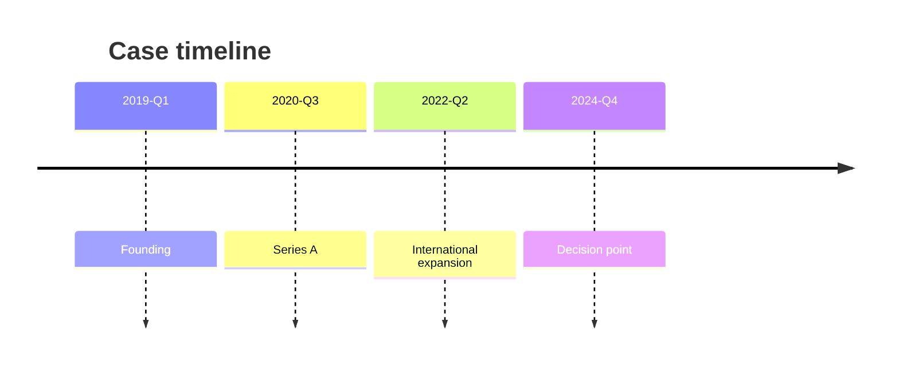
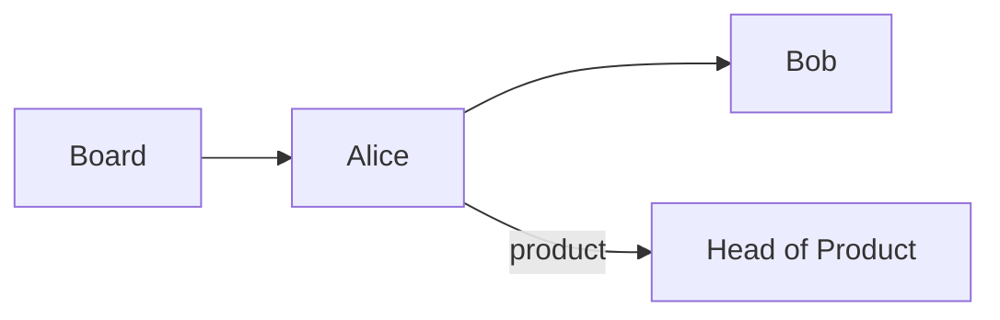

# Evidence pack schema

The evidence pack consists of six files in `case-<slug>/research/`.
All file names are English. The taxonomy in `case-folder-convention.md`
gives Portuguese equivalents for author-facing communication. Completion
readiness rules are in [`research-gates.md`](research-gates.md).
This file is the shape of the records those gates read.

## Common frontmatter

Every file in the evidence pack carries the same frontmatter block at the top:

```yaml
---
case_slug: <slug>
skill: case-research
version: 1
generated_at: <ISO-8601>
inputs:
  - research/sources/public/<source-id>/<file>
  - research/sources/private/<interview-id>/<file>
provenance:
  public_count: <int>
  private_count: <int>
  verify_count: <int>          # number of [VERIFY] tags across the pack
limitations:
  - <string>
decision:
  decision_morning: <date|null>
  last_primary_filing: <date|null>
teaching_tension: <string|null>   # copied from intake; null when unset
contrast_set: <list|null>         # copied from intake; null when unset
---
```

After the frontmatter, the file body uses `## Source / Page` headings per
extract, with verbatim text and a citation footer.

## timeline.md

Chronological event map. Two parallel views:



Then a Markdown table:

```markdown
| Date | Event | Source | Page | Public/Private |
|---|---|---|---|---|
| 2019-03 | Founding of <company> | research/sources/public/SEC-10K | 12 | public |
| 2020-09 | Series A funding round | research/sources/private/interview-CEO | 3 | private |
```

Every row links to the source file and (when applicable) page number.

## cast.md

Dramatis personae. Markdown table with one row per actor, plus a Mermaid
`graph` showing relationships:

```markdown
| Name | Role | Motivation | Key relationships | Source |
|---|---|---|---|---|
| Alice | CEO | Take company global | Reports to board; peer of CFO | research/sources/private/interview-CEO |
| Bob | CFO | Manage risk | Reports to CEO; reports to board | research/sources/private/interview-CFO |
```



When the firm is several businesses, include the operating head of each
business the decision uses, when a source names them, and one sourced line
on how that business makes money. People who never speak about the
decision stay in this file and out of the narrative. A decision-relevant
voice with no primary words is `[MISSING]` on that row. Do not
draft the sentence.

```markdown
| Largest shareholder | Owner | [MISSING] — no primary words; ask the author | Board | no primary source |
```

## financials.md

Extracted numbers and ratios. Each table row is one observation:

```markdown
| Metric | Period | Value | Unit | Source | Page |
|---|---|---|---|---|---|
| Revenue | FY2023 | 12.4 | BRL MM | research/sources/public/annual-report-2023 | 47 |
| EBITDA margin | FY2023 | 18 | % | research/sources/public/annual-report-2023 | 47 |
| Headcount | FY2023 | 240 | — | research/sources/private/interview-CFO | 8 |
```

Numbers from secondary sources are flagged `[VERIFY]`.

When a material fact may have changed between an earlier source and the
decision, record both clocks in this file or `timeline.md`:

```markdown
| Fact | As of last primary filing | As of decision morning | Later fact the case uses | Source |
|---|---|---|---|---|
| Long-term debt | 40, as of 15 January | 0, repaid 20 February | 0, repaid 20 February | research/sources/public/morning-paper, decision morning |
```

Search the gap for relevant changes. When the clocks differ, the later
sourced fact is the one the case uses, and its date and source are shown.
Do not create a second observation for stable facts or cases without filings.
The figures above are a shape sample. Replace them with sourced figures.

## quotes-by-theme.md

Verbatim quotes tagged by theme:

```markdown
## Theme: pricing pressure

> "We were losing 15% margin on the premium line by mid-2023."
> — Alice (CEO), research/sources/private/interview-CEO, p. 4

## Theme: international expansion

> "Brazil was the test market; Argentina came second."
> — Bob (CFO), research/sources/private/interview-CFO, p. 11
```

Themes are H2 headings; each quote is a blockquote with attribution
inline. Quotes preserve the original language of the source. The case and
the teaching note translate a quotation for the reader. This file does not.

When contemporary press raises a decision-relevant objection, file it under
`the outside objection` with the sourced responses available. Otherwise
record the sourced tension or event that can open the case. A decision-relevant voice with
no primary words is `[MISSING]`, followed by the question to the author.
Do not draft the sentence.

```markdown
## Theme: the outside objection

> "The lead product may not be repeated by the three smaller ones."
> — city paper, research/sources/public/city-paper-decision-morning, p. 1

## Theme: the decision

> [MISSING] — largest shareholder. No primary words. Ask the author whether an interview exists.
```

## exhibit-candidates.md

Proposed exhibits (figures, tables) for the case narrative:

```markdown
## Exhibit 1: revenue growth 2019-2024

**Source data:** research/sources/public/annual-report-2023, p. 47
**Type:** line chart
**Status:** candidate

| Year | Revenue (BRL MM) |
|---|---|
| 2019 | 3.2 |
| 2020 | 4.1 |
| 2021 | 6.8 |
| 2022 | 9.5 |
| 2023 | 12.4 |
```

### Calculable exhibit

For a quantitative economic choice, one candidate has to let a student
calculate the consequence of each option. A segment income statement alone
does not satisfy this gate. The following template applies when the choice
is an asset-light contract versus a capital-intensive alternative.

```markdown
## Exhibit: what each party keeps

**Choice:** asset-light contract versus building the plant
**Status:** required for that choice
**Worked example:** lead-product receipts under the contract, arithmetic visible

| Arrangement | Who finances | Who sets the date | Share of primary revenue | Share of downstream revenue | Cap | Source |
|---|---|---|---|---|---|---|
| License | Partner | Partner | Firm 8%, partner the rest | Firm 15% of licensed categories | 12 per year | research/sources/public/contract-note |
| Plant | Firm | Firm | Firm keeps the primary revenue | Firm keeps the downstream revenue | none | research/sources/public/plant-proposal |

Worked example: primary receipts of the lead product are 40. Under the license the firm keeps 8% of 40, which is 3.2. Downstream receipts are 20, and the firm keeps 15% of 20, which is 3. The plant alternative keeps 40 + 20 and carries the build cost the source states. Replace every number with a sourced figure.
```

### Contrast-set rows

When `contrast_set` is set, one row per item with the decision-relevant
dimensions. The table below illustrates a portfolio comparison; omit fields
that do not matter to another decision. When it is `null`, omit the table.
Do not invent items.

```markdown
| Item | Who controls it | What it has earned | Feeds the rest of the business | Fame relative to the lead | Result against cost | Type of participation | Downstream it can feed | Downstream it cannot feed | Source |
|---|---|---|---|---|---|---|---|---|---|
| Smaller product A | Partner, by contract | 4 last year | No | Below the lead | Covered its cost | License | One licensed category | Apparel, promotions | research/sources/public/city-paper-decision-morning |
```

### Industry slice

One short exhibit when market structure affects the decision. Market size,
firm share, rivals, and an adjacent launch are examples of relevant fields,
not mandatory data for every case.

```markdown
| Market | Size | Firm share | Named rivals | Adjacent product about to arrive | Source |
|---|---|---|---|---|---|
| The relevant market | 900 | 11% | North Co, South Co | Rival product due the next month | research/sources/public/trade-association |
```

### Asset structure

When sources describe the asset as families, clusters, or a system,
extract that structure here. A headcount is not a strategy. Record the
families, clusters, or system the source names, with the source. When the
source gives only a count, keep the count in `financials.md` and record
the missing structure as a gap in `extraction-log.md`.

## extraction-log.md

What was extracted, from where, gaps:

```markdown
## Extracted

- 2019-2023 financial summary from SEC 10-K (public)
- Pricing pressure narrative from CEO interview (private)

## Gaps

- Q3-2024 financials not yet released at extraction time
- Head of Product interview transcript has [ILLEGIBLE] on p. 5
```

## File name taxonomy

| English (canonical) | Portuguese |
|---|---|
| `timeline.md` | (linha do tempo) |
| `cast.md` | (personagens) |
| `financials.md` | (dados financeiros) |
| `quotes-by-theme.md` | (citações por tema) |
| `exhibit-candidates.md` | (candidatos a exhibit) |
| `extraction-log.md` | (log de extração) |
