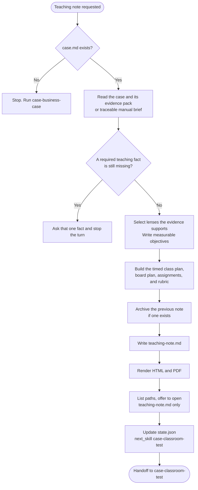

# case-teaching-note

Writes the instructor-facing teaching note that pairs with `case.md` from `case-business-case`. The case is the story. The note is the pedagogy: curriculum placement, theoretical lenses, a timed class plan with Socratic questions, a board plan, assignments, and an assessment rubric. Theory lives here, not in the case body. The note Markdown stays canonical. The skill also writes HTML and PDF and asks which format to open.

## Install

The fastest cross-agent install path is the `skills` CLI:

```bash
npx skills add gg-skills/case-teaching-note
```

Drop this skill into a workspace as a Git submodule for pinned versions, or as a plain clone for latest `main`:

```bash
# Project-local, version-pinned:
git submodule add git@github.com:gg-skills/case-teaching-note.git .claude/skills/case-teaching-note

# OR project-local, latest main:
mkdir -p .claude/skills
git -C .claude/skills clone git@github.com:gg-skills/case-teaching-note.git

# OR user-level, available in every project on this machine:
mkdir -p ~/.claude/skills
git -C ~/.claude/skills clone git@github.com:gg-skills/case-teaching-note.git
```

Restart your agent or reload skills after installation. See the parent [`skills` catalog repo](https://github.com/gg-skills/skills) for the full catalog.

## When to use

- `case.md` exists at the case root, or the caller supplies a variant's `case.md`, and the author wants the teaching companion.
- An existing case is being repurposed for another course, level, or time budget.
- The author wants to refresh the Socratic questions after a pilot.

**Skip when:**

- There is no case narrative yet. Run `case-business-case` first.
- The deliverable is a research dossier rather than a teaching instrument.
- The course is lecture-only, a lab, or another non-case format.

## How it operates

### Inputs

**Case and evidence** — `case.md` plus `research/timeline.md`, `cast.md`, `financials.md`, and `quotes-by-theme.md`.

**Intake** — `internal/intake.yaml`. Use `discipline` and `audience_level` when they are set. `discipline` is a list, and a note for several disciplines serves each one. The first version is written without questions: stored or implied level (default graduate), a suggested syllabus position, 80 minutes, and lenses the evidence supports, each stated in the note. Adjustments to level, syllabus position, class length, and lenses are offered after the note is written.

**Optional rubric** — criteria from an earlier `case-classroom-test` run. Otherwise the note uses a five-criterion default: issue identification, framework application, evidence use, position defense, and transfer.

### Outputs

- `case-<slug>/teaching-note.md` — objectives, lenses, class plan, board plan, assignments, and rubric.
- `teaching-note.html` and `teaching-note.pdf` beside that Markdown.
- Updated `internal/state.json` with `stage: "case-teaching-note"`, `next_skill: "case-classroom-test"`, and one history entry.

A replacement moves the existing note and its `.html` and `.pdf` into `archive/<yyyy-mm-dd-hhmm>/` first. A variant run reads and writes the caller's paths and leaves the masters in place.

### External commands

```bash
node .agents/skills/case-teaching-note/scripts/render-reader-formats.ts \
  --input case-<slug>/teaching-note.md

node .agents/skills/case-teaching-note/scripts/render-reader-formats.ts \
  --input case-<slug>/teaching-note.md --open pdf
```

List every generated path, then offer to open only the teaching note (`teaching-note.md`), PDF first. Pass `--open` only after the author chooses a format. PDF printing uses headless Chrome or Chromium (`CASE_WRITING_CHROME` or `--chrome PATH`).

### Side effects

- Writes the teaching note and its reading copies.
- May write a level, discipline list, or location answer back into `internal/intake.yaml` and `config`. Syllabus position, class length, and lenses stay in the note.
- Does not write the case narrative, run the class, or submit to a journal.
- Does not invent theory citations. Every reference comes from the evidence pack or the author's uploads.
- Does not commit or publish.

### Mode toggles

| Mode | Behavior |
|------|----------|
| Default length | 80 minutes once the author defers: four blocks plus a 5-minute buffer |
| Other lengths | 60, 90, or 180 minutes. Scale the blocks and keep a short transfer segment |
| Missing fact | Ask one fact and stop. Do not ask the set together |
| Variant | Write the variant note. Preserve the master |

The 80-minute example is 15 minutes of cold open and context, 20 of dilemma and data, 20 of the decision, 20 of wrap-up and transfer, and 5 of buffer.

## Operational flow



## Layout

```
.
├── SKILL.md
├── README.md
├── package.json
├── agents/
│   └── openai.yaml
├── assets/
│   └── icon-small.svg
├── references/
│   ├── class-plan-template.md        ← 60, 80, 90, and 180 minute plans
│   ├── socratic-questions.md         ← question ladders for each block
│   ├── case-folder-convention.md
│   └── reader-formats.md
└── scripts/
    └── render-reader-formats.ts
```

## Quick start

Read [`SKILL.md`](./SKILL.md) and the class-plan template for the author's time budget.

```bash
node .agents/skills/case-teaching-note/scripts/render-reader-formats.ts \
  --input case-<slug>/teaching-note.md
```

Questions must be answerable from the case plus the declared prerequisites. Put the worked analysis in the note so another instructor can teach it cold.

## Resources

- [`SKILL.md`](./SKILL.md) — interview, theory scan, class plan, and state update
- [`references/class-plan-template.md`](references/class-plan-template.md) — timed variants
- [`references/socratic-questions.md`](references/socratic-questions.md) — what each block's questions must do
- [`references/case-folder-convention.md`](references/case-folder-convention.md) — folder and state schema
- [`references/reader-formats.md`](references/reader-formats.md) — render rules, paths to list, and the one file to offer to open
- [`agents/openai.yaml`](agents/openai.yaml) — agent interface definition

## Caveats

- **Paraphrase the case.** The note analyzes. It does not paste the case body.
- **Do not hide required theory inside the case.** Assign it as a reading or as prior coursework.
- **Fit the clock.** The plan includes a short buffer. A pilot that overruns usually means the blocks were too full.
- **Fewer lenses.** Keep only the ones the objectives need.
- **Include the instructor's analysis.** Open prompts still need worked calculations, plausible answers, and trade-offs.
- **Citations come from the pack or the author's uploads.** Do not add a framework the evidence does not support.
- **A quotation is already in the note's language.** The highlighted sentence is that wording. `*Original:*` is the optional verbatim line beneath it.
- **A finished note is not an approved case.** Classroom testing and review can still send it back for revision.
- **Markdown stays canonical.** Regenerate HTML and PDF from the note.
