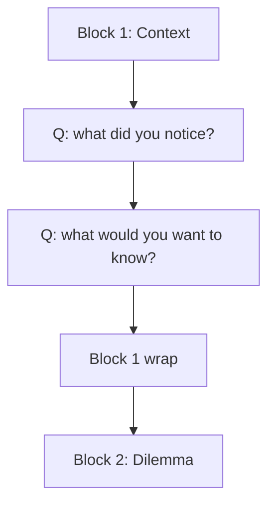

# Class plan template

Four time variants: 60, 80 (default), 90, and 180 minutes. These are starting points; adapt activities to the objectives and cohort
while keeping the total within the requested duration, including a buffer.
Every plan retains synthesis and transfer.

## Block anatomy (80-minute default)

| Block | Duration | Purpose | Question style |
|---|---|---|---|
| 1 — Cold open + context | 15 min | Surface student assumptions; orient them to the case. | "What did you notice first? What would you want to know before deciding?" |
| 2 — Dilemma + data | 20 min | Test comprehension; force trade-off articulation. | "What's the protagonist giving up if they choose option A? What evidence supports that?" |
| 3 — Decision moment | 20 min | Force a position and require defense. | "What would you do? What would the protagonist's critics say?" |
| 4 — Wrap-up + transfer | 20 min | Connect to prior cases or student's experience; preview next class. | "Where have you seen this pattern before? What does it predict for next week?" |
| Buffer | 5 min | Overrun allowance. | — |

Total: 80 minutes, including the buffer.

## Variants

### 60-minute (compress blocks; retain transfer)

| Block | Duration | Purpose |
|---|---|---|
| 1 — Cold open + context | 10 min | Surface assumptions |
| 2 — Dilemma + data | 20 min | Comprehension + trade-offs |
| 3 — Decision moment | 15 min | Position + defense |
| 4 — Wrap-up + transfer | 10 min | Synthesis and application elsewhere |
| Buffer | 5 min | Overrun |

### 90-minute (add generalization)

| Block | Duration | Purpose |
|---|---|---|
| 1 — Cold open + context | 15 min | Surface assumptions |
| 2 — Dilemma + data | 20 min | Comprehension + trade-offs |
| 3 — Decision moment | 20 min | Position + defense |
| 4 — Generalization | 20 min | Compare with other cases / frameworks |
| 5 — Wrap-up | 10 min | Connect to next class |
| Buffer | 5 min | Overrun |

### 180-minute (extended analysis with break)

| Block | Duration | Purpose |
|---|---|---|
| 1 — Cold open + context | 20 min | Surface assumptions |
| 2 — Dilemma + data | 30 min | Deep comprehension + trade-offs |
| Break | 15 min | |
| 3 — Decision moment | 30 min | Position + defense |
| 4 — Extended activity | 30 min | Group analysis, role discussion, or an available guest speaker |
| 5 — Generalization + wrap-up | 45 min | Compare, transfer, preview |
| Buffer | 10 min | Overrun |

## Question ladder per block

Each block has 4–6 pre-written questions. The instructor picks 2–3 per
block based on class energy. See `socratic-questions.md` for what makes
a question good.

## Board plan

Each block has a board plan: a Mermaid `flowchart` or structured outline
that a colleague can recreate on a whiteboard without notes. The board
plan is in `teaching-note.md`, not a separate file.

## Pre / in / post assignments

- **Pre-class** (individual): read the case + write a 1-paragraph position on what the protagonist should do.
- **In-class** (group, when applicable): same prompt, in groups of 3–4.
- **Post-class** (individual or group): 1-page memo defending the position or reflecting on the discussion.

## Assessment rubric (default 5-criteria)

| Criterion | Weight | Description |
|---|---|---|
| Issue identification | 20% | Did the student correctly identify the protagonist's decision? |
| Framework application | 25% | Did the student apply one or more of the theoretical lenses correctly? |
| Evidence use | 25% | Did the student cite specific case text or exhibits? |
| Position defense | 20% | Did the student defend a position against counterarguments? |
| Transfer | 10% | Did the student connect the case to other contexts? |

If `case-classroom-test` has run and produced a rubric, prefer that.

## Portuguese taxonomy

| English | Portuguese |
|---|---|
| Cold open | (abertura provocativa) |
| Socratic questions | (perguntas socráticas) |
| Board plan | (plano de quadro) |
| Pre-class assignment | (tarefa pré-aula) |
| Post-class reflection | (reflexão pós-aula) |
| Cold call | (pergunta direta a um aluno) |
